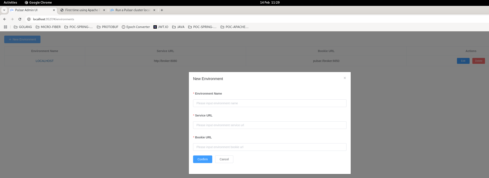
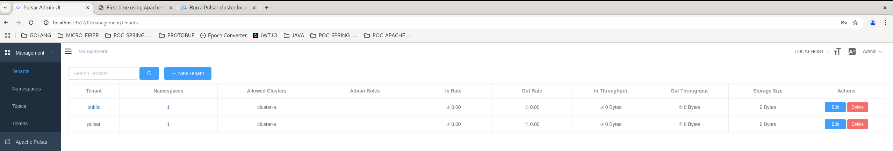

# poc-apache-pulsar

## Docker Setup

Create required directories in docker directory:

```bash
sudo mkdir -p ./data/zookeeper ./data/bookkeeper

sudo chown -R 10000 data
```

Launch cluster:

```bash
docker-compose -f pulsar.yml up -d
```

Docker containers

| Container       | Version | Port        | Description                               |
|-----------------|---------|-------------|-------------------------------------------|
| zookeeper       | 4.0.2   | -           |                                           |
| pulsar-init     | 4.0.2   | -           | Initialize cluster                        |
| bookie          | 4.0.2   | 3181 / 8000 |                                           |
| broker          | 4.0.2   | 8080 / 6650 | Admin endpoints (8080), Listener (6650)   |
| web-gui         | 0.24.0  | 9527        | Pulsar-Manager GUI                        | 


## Admin GUI

Once containers are started, you need to create an admin account.

To achieve this, launch the following commands to create an admin / apachepulsar:

```bash
CSRF_TOKEN=$(curl http://localhost:7750/pulsar-manager/csrf-token);
curl \
       -H 'X-XSRF-TOKEN: $CSRF_TOKEN' \
       -H 'Cookie: XSRF-TOKEN=$CSRF_TOKEN;' \
       -H "Content-Type: application/json" \
       -X PUT http://localhost:7750/pulsar-manager/users/superuser \
       -d '{"name": "admin", "password": "apachepulsar", "description": "test", "email": "username@test.org"}';
```

Once authenticated, click on "New Environment" button.



To retrieve the right urls, enter "broker" container:

```bash
docker exec -it broker bash;
```

And then in container, do:

```bash
./pulsar-admin clusters get cluster-a;
```

You should have a result like the following:

```json
{
"serviceUrl" : "http://broker:8080",
"brokerServiceUrl" : "pulsar://broker:6650",
"brokerClientTlsEnabled" : false,
"tlsAllowInsecureConnection" : false,
"brokerClientTlsEnabledWithKeyStore" : false,
"brokerClientTlsTrustStoreType" : "JKS",
"brokerClientTlsKeyStoreType" : "JKS",
"brokerClientSslFactoryPlugin" : "org.apache.pulsar.common.util.DefaultPulsarSslFactory"
}
```

Copy serviceUrl value in "Service URL" pop-up, and brokerServiceUrl in "Bookie URL"

Finally, in tour environment, you'll gain access to cluster management:



## Spring Boot

By convention topics must follow this pattern: "{persistent|non-persistent}://tenant/namespace/topic"

Spring boot application.yml config file:

```yml
app:
  config:
    pulsar:
      adminUrl: "http://192.168.1.15:8080"
      cluter: "cluster-a"
      tenants:
        - name: "mytenant"
          cluster: "cluster-a"
      namespaces:
        - name: "mytenant/myns"
          nbOfBundles: 1
      topics:
        - name: "persistent://mytenant/myns/topic1"
          nbOfPartitions: 1
        - name: "persistent://mytenant/myns/topic2"
          nbOfPartitions: 2
```

In this application, tenant, namespace and topics are created at application startup in AppStartedListener class